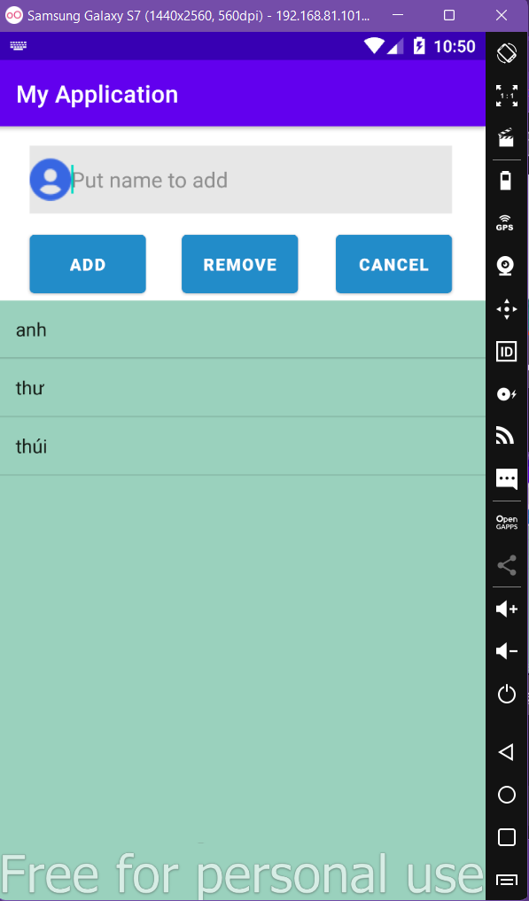
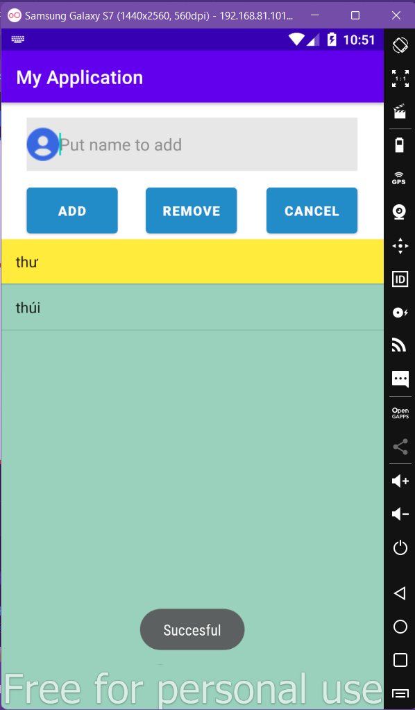
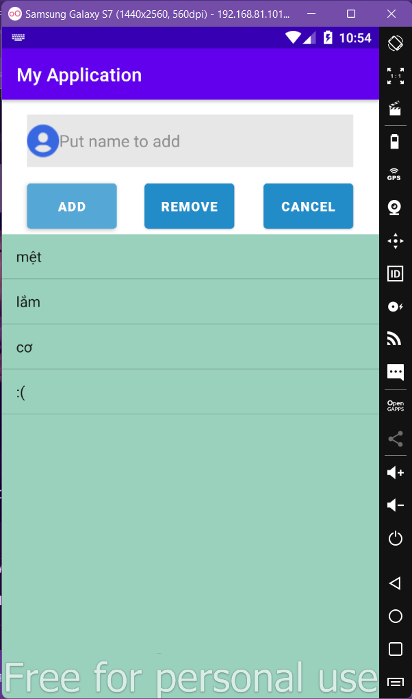
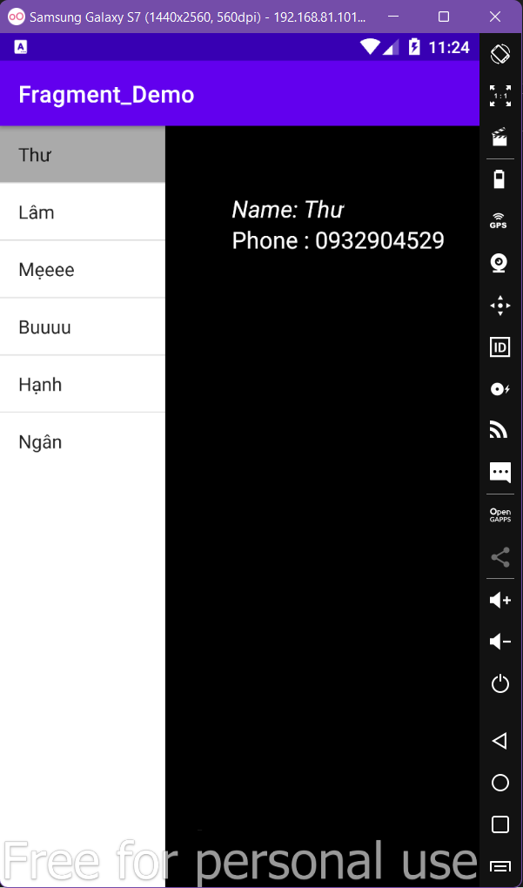
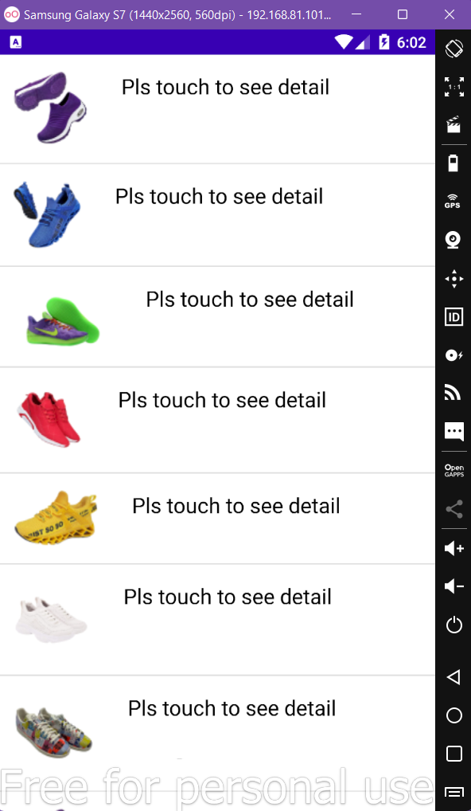
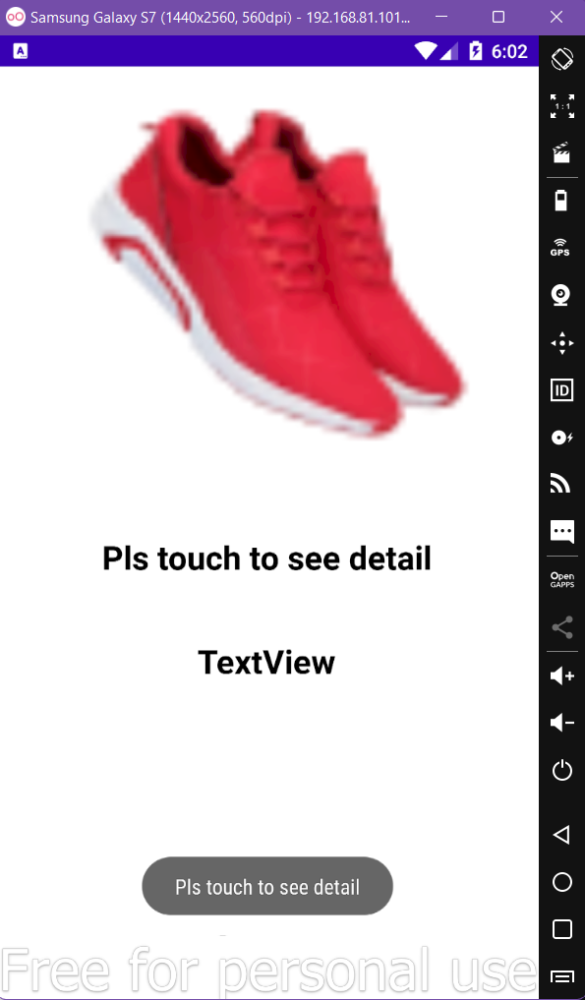

# android_demo baitap tuan 7,8,9

<h1> After delete </h1>

<h1> After add </h1>

# android_demo baitap tuan 1,2,3

<h1>After click Donut A </h1>

<h1>After click Donut B </h1>

<h1>Search  </h1>

<h1>When click button Donut A  </h1>

<h1>Ôn tập GK (ở trong file Profile 🤟) </h1>

# android_demo baitap tuan 4,5,6
<h1>Demo Fragment 😥 </h1>

<h1>List Fragment </h1>

<h1>After click 1 product </h1>

